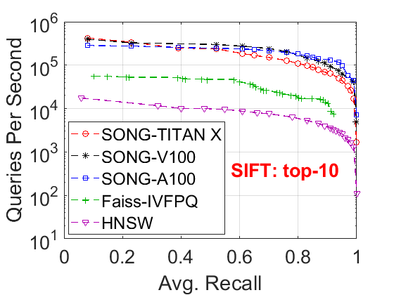
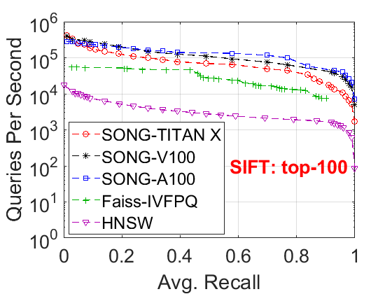
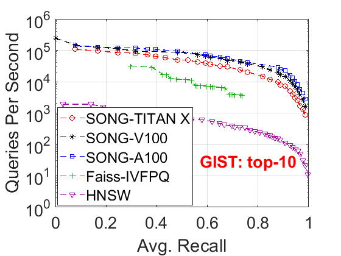
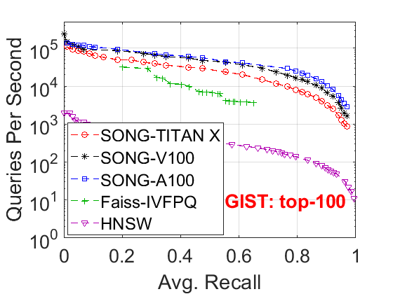
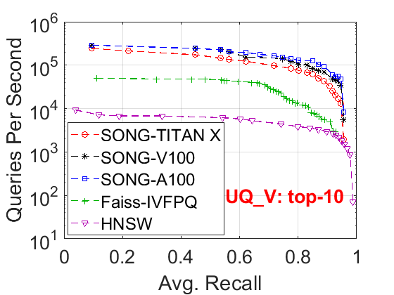
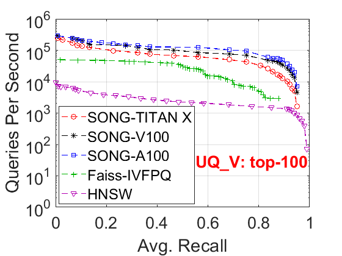

# SONG: Approximate Nearest Neighbor Search on GPU

Welcome to the SONG Github!

SONG is a graph-based approximate nearest neighbor search toolbox. It implements the graph searching algorithm and optimizations of [SONG: Approximate Nearest Neighbor Search on GPU](http://research.baidu.com/Public/uploads/5f5c37aa9c37c.pdf) in [ICDE 2020](https://www.utdallas.edu/icde/).

## Performance
SONG has the **best** searching performance over other GPU-based ANN solutions. Here we present the performance comparison on 3 datasets over NVIDIA TITAN X, V100, and A100:

**SIFT1M**

 

**GIST1M**

 

**UQ_V**

 

## Installation and Usage

### Prerequisites
We have tested SONG on the following versions of prerequisites.
```
g++ 5.4.0, 9.3.0
CUDA 10.0, 10.1
```
Other versions may also work. There was a known issue for `g++-4.8`. Please consider newer versions of `g++`.

### Code Templates Generation
The parameters of the searching algorithm are hard-coded for the best performance. We first need to generate the code templates with placeholders for the next step.
```
./generate_template.sh
```

### Fill Parameters
The vector file should be in *one-based LIBSVM* format.
For example, let's download the [letter](https://www.csie.ntu.edu.tw/~cjlin/libsvmtools/datasets/multiclass.html#letter) dataset  from LIBSVM website.
We assume `letter.scale` and `letter.scale.t` are stored in the working directory.
We first need to fill the parameters into the generated code templates.
```
Usage: ./fill_parameters.sh <pq_size> <dim> <cos/l2/ip>
For example: ./fill_parameters.sh 100 16 cos
```

`<dim>` is the number of dimensions of the dataset. For the example letter dataset, it has 16 dimensions.
`<pq_size>` is a searching parameter. We use `100` here for demonstration only. You can tune the parameter for your desired performance. The greater it is, the better recall we obtain in the searching result (with the cost of longer running time). Note that due to the GPU memory limit, you cannot set an arbitrary large number for `pq_size`. Having a too large number will cause a crash in runtime.

`<cos/l2/ip>` is the similarity/distance measure. `cos` for Cosine similarity, `l2` for L2 distance/Euclidean distance, and `ip` for max inner-product search.

### Build Graph Index
We have to have a graph index before we apply the GPU searching algorithm in SONG.
```
Usage: ./build_graph.sh <build_data> <row> <dimension> <l2/ip/cos>
For example: ./build_graph.sh letter.scale 15000 16 cos
```

### Run SONG GPU Searching Algorithm
```
Usage: ./test_query.sh <query_data> <built_graph_row> <built_graph_dimension> <l2/ip/cos> [display top k]
For example: ./test_query.sh letter.scale.t 15000 16 cos
Use display top 5: ./test_query.sh letter.scale.t 15000 16 cos 5
```
The output is the zero-based base vector indices. One line corresponds to one query.
The similarity/distance measure should match the parameter we provide in `fill_parameters.sh`.

## FAQ
1. What should I do if I have the required versions of `g++` and `nvcc` as alternatives and I have not privilege/do not want to set them as default ones?
Open **Makefile** and replace the `g++` and `nvcc` with the paths to your executables of the specific versions.

2. How to tailor the compilation flags for my GPU devices?
You can modify the `-arch` and `-gencode` options in the `Makefile`. More details can be found here: [Options for Steering GPU Code Generation](https://docs.nvidia.com/cuda/cuda-compiler-driver-nvcc/index.html#options-for-steering-gpu-code-generation) and [GPU Feature List](https://docs.nvidia.com/cuda/cuda-compiler-driver-nvcc/index.html#gpu-feature-list).

3. I am a fan of zero-based index. What should I do if I have a zero-based LIBSVM file?
Open **parser.h** and change the variable `ONE_BASED_LIBSVM` to `0`.

4. How can I change the parameters of the proximity graph, e.g., degree, searching budget in graph construction?
We have two macros in *config.h*: `SEARCH_DEGREE` and `CONSTRUCT_SEARCH_BUDGET`. You can change them to your desired values. Just remember to re-do `./generate_template` and `./fill_parameters` to recompile the code.

5. SONG is a GPU graph searching algorithm. Can I use SONG on my own proximity graph index?
Sure. All you need to do is to dump your graph and data into the plain binary format that SONG uses.
SONG loads two files before the searching:
`bfsg.graph: proximity graph` and `bfsg.data: vector data`. 
We denote `n` as the number of vectors and `dim` as the number of dimensions. Please check **config.h** for other mentioned constants/types in the following.
`bfsg.graph` has `n * (2^FIXED_DEGREE_SHIFT)` `idx_t`-type binary values. Each `(2^FIXED_DEGREE_SHIFT)` values corresponds to a vertex. The first value is the out-degree of the vertex and its following values are the zero-based index of its out-going vertex.
`bfsg.data` has `n * dim` `value_t`-type binary values. Each `dim` values corresponds to a base data vector. 
You can dump these binary files easily in your code, e.g., with `fwrite` in C++.

6. I installed nvcc and got errors like "sh: 1: cicc: not found" or "cc1plus: fatal error: cuda\_runtime.h: No such file or directory" in the compilation. What should I do?
This may happen when the path of the default `nvcc` executable is not well configured. Try to edit the variable `NVCC` in *Makefile* and point `NVCC` to the non-symbolic-link executable of your installation, e.g., `NVCC=/usr/local/cudaX-Y/bin/nvcc`, where `cudaX-Y` is the cuda version you have.

7. How do I specify a GPU to use?
SONG performs the same as other CUDA programs. You can specify the GPU you want with the environment variable CUDA_VISIBLE_DEVICES. Notice that SONG is a computation and resource intensive program. We highly recommend to only run SONG on an idle GPU device to obtain the best performance.

## Todo List
- [ ] Add a python interface
- [ ] Add tensor core optimizations

## Reference

Reference to cite when you use SONG in your paper:
```
@inproceedings{DBLP:conf/icde/ZhaoTL20,
  author    = {Weijie Zhao and
               Shulong Tan and
               Ping Li},
  title     = {{SONG:} Approximate Nearest Neighbor Search on {GPU}},
  booktitle = {36th {IEEE} International Conference on Data Engineering, {ICDE} 2020,
               Dallas, TX, USA, April 20-24, 2020},
  pages     = {1033--1044},
  publisher = {{IEEE}},
  year      = {2020}
}
```

